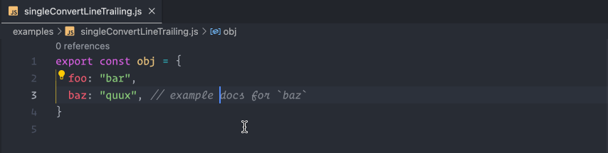
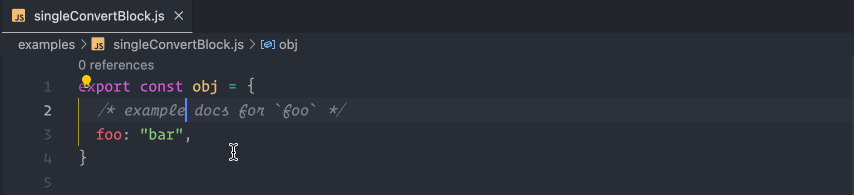
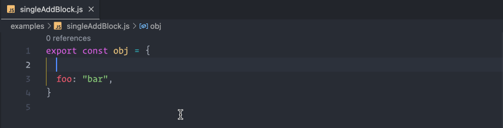
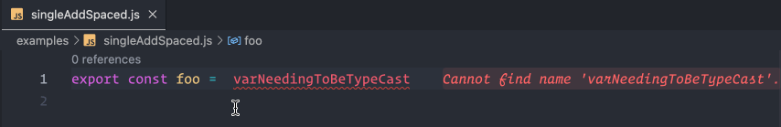

# jsdoc comment toggler

extension to toggle a JSDoc comment on the target text, properly indenting and spacing
everything

no longer will you need to flip around between comment tags while converting a
JavaScript block or line comment into more formal JSDoc; put your cursor inside a
comment and bam

## Features

- convert a line comment into JSDoc and vice versa
  
- convert a block comment into JSDoc and vice versa
  
- generate a new JSDoc comment to start documenting a variable
  
- generate inline JSDoc for "casting" a value with `@type`
  

## Usage

- command: `Toggle JSDoc Comment`
- keyboard shortcut: `ctrl+r ctrl+/` or `cmd+r cmd+/` for MacOS
  - the shortcut uses chords - press the first key combination, release, and then
    press the second (tip: you can hold `ctrl`/`cmd` the whole time)
  - change shortcut in Preferences -> Keyboard Shortcuts -> Search "jsdoc-comment-toggler"

## Extension Settings

- `jsdoc-comment-toggler.cursorHack` - use a cursor "hack" to avoid a VSCode issue where it's impossible to add text after the cursor when it's at the end of the line. In that scenario, this hack inserts a snippet with a zero-width-space after the cursor to invisibly keep the cursor in the correct position. The zero-width-space is removed when the comment tags are added. This hack is safe to use as VSCode will highlight the zero-width-space for you to manually remove if something fails. If you ever see a zero-width-space in a comment, please create an issue on GitHub with a reproducible case.
  - default: `false`
  - still searching for a better way to do this and/or guarantee that a zero-width-space won't be left behind

## TODO

- [ ] merge comments and JSDoc nested inside JSDoc
- [ ] wrap single line selection in parens for casting
- [ ] test placement of selection anchor and active for multiline comments
- [ ] convert to block comment when cursor is anywhere within JSDoc
- [ ] convert multiple adjacent (or empty) line comments into a single JSDoc block

## Reporting issues

report any issues on the github
[issues](https://github.com/zachhardesty7/jsdoc-comment-toggler/issues) page, and please
provide as much detail as possible!

## License

This project is licensed under the MIT License - see the [LICENSE](LICENSE) file for details
